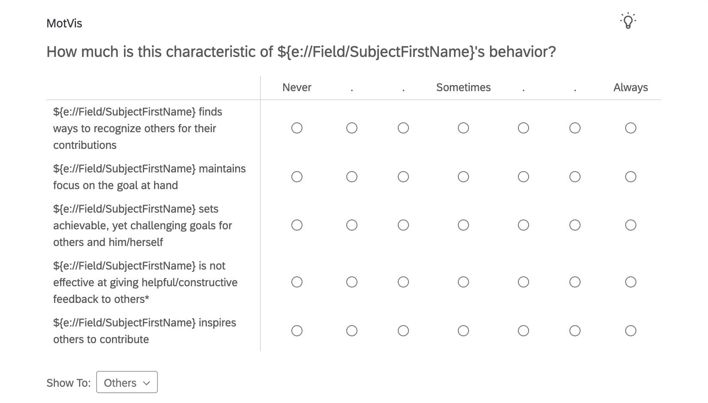
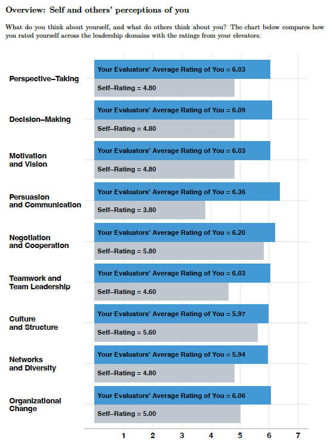
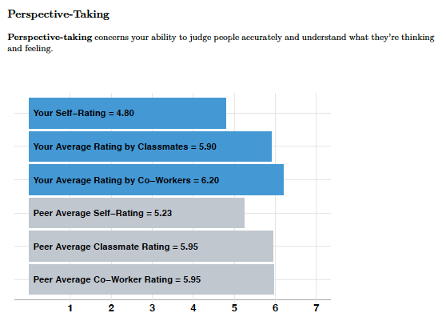

**I built, automated, and owned Columbia Business School’s 360° Leadership Feedback system, used by all MBA and EMBA students to deliver personalized, multi-source leadership reports at scale in support of leadership development. The work was recognized with a school-wide teaching award.**

```{=html}

<div style="display:flex; gap:24px; align-items:flex-start; margin-top:24px;">

  <!-- LEFT: Text (70%) -->
  <div style="flex:0.7; min-width:260px;">
    
    <h1 style="margin-top:0;">Context & Problem</h1>

    <p>
      Upon starting their MBA and EMBA programs, students at Columbia Business School participate in an intensive, week-long leadership course led by faculty in the Management Division. This course marks the <strong>beginning of their leadership development journey</strong>, during which students create a personal leadership action plan that accompanies them throughout their program.
    </p>

    <p>
      As part of this process, students complete the <strong>Lead 360 survey</strong>: a multi-source assessment that combines self-ratings, classmate evaluations, and feedback from past coworkers across a broad set of leadership skills and traits. After a month of data collection, students receive a <strong>detailed feedback report</strong> showing how they see themselves, how others see them, and how they compare to their peers. This report serves as the <strong>foundation for an executive coaching session, where students translate feedback into a concrete development plan</strong>.
    </p>
    
    <p>
      Prior to Fall 2022, the Management Division relied on an expensive third-party solution through Qualtrics XM, which generated only basic summary statistics and offered limited flexibility in how feedback was presented. Faculty wanted a system that could deliver deeper, more interpretable insights while scaling reliably to thousands of students on a strict academic timeline.
    </p>
    
    <p>
      In response, <strong>I designed and built a new end-to-end system for generating and delivering personalized 360° leadership feedback</strong>. Over the course of three years, I developed the infrastructure and processes that now support this experience for all MBA and EMBA students at Columbia Business School.
    </p>

  </div>

  <!-- RIGHT: Figure (30%) -->
  <div style="flex:0.3; min-width:320px;">
    
  </div>

</div>

```

# My Role & Ownership

I was the sole owner of the 360° Leadership Feedback system from initial design through production. I built the entire codebase from scratch, designed the data pipelines and automation infrastructure, and made core decisions about how multi-source feedback was processed, summarized, and presented to students.

Beyond implementation, I partnered closely with Management Division faculty and the Bernstein Center for Leadership to translate pedagogical goals into interpretable, actionable feedback. This included decisions about which comparisons to surface, how to balance clarity with analytical depth, and how to present sensitive peer feedback in a constructive way.

Over time, I evolved the system into a largely hands-off, fully automated workflow that reliably generated and distributed personalized PDF reports to thousands of students on a fixed academic timeline. I documented the system and structured the code to enable a smooth handoff to a dedicated data science team when I transitioned off the project.

# The Product: Personalized 360 Reports

## The Lead 360 Survey

```{=html}
<div style="display:flex; gap:2rem; align-items:flex-start; margin:1.5rem 0;">

  <!-- Left column: bullets / text -->
  <div style="flex:1; min-width:0;">

    <ul>
      <li><strong>Self-assessment:</strong> During the week-long leadership course, students complete a self-assessment, rating their own leadership behaviors across a shared set of attributes.</li>

      <li><strong>Coworker feedback:</strong> Students nominate current or former coworkers, who complete an individualized version of the <em>same survey</em>, rating the student on the exact items used in the self-assessment.</li>

      <li><strong>Classmate feedback:</strong> Classmates, primarily within learning teams, provide peer evaluations informed by intensive teamwork, projects, and leadership exercises.</li>

      <li><strong>Privacy safeguards:</strong> Reports are generated only when a minimum of <strong>three raters per category</strong> are collected, preserving anonymity and encouraging candid feedback.</li>
    </ul>

  </div>

  <!-- Right column: image + caption -->
  <div style="flex:0 0 50%; text-align:center;">

    

    <div style="font-size:0.85rem; color:#666; margin-top:0.5rem;">
      Example of peer-report survey on students' Motivation and Vision.
    </div>

  </div>

</div>
```

This design produces aligned, multi-source feedback that supports both meaningful self–other comparison and downstream aggregation in the final report.

## High-Level Feedback Overviews

```{=html}
<div style="display:flex; gap:2rem; align-items:flex-start; margin:1.5rem 0;">

  <!-- Left column: bullets / text -->
  <div style="flex:1; min-width:0;">

    <ul>
      <li><strong>Self vs. others’ perceptions:</strong> One overview compares how students rated themselves with how they were rated by their evaluators. This view helps students assess how accurately they understand the impact of their behavior on others—an especially important insight for leaders working to calibrate their presence.</li>

      <li><strong>Calibration and reassurance:</strong> For many students, this comparison reveals that they are viewed more positively by others than they view themselves. Identifying the specific domains where this is most pronounced helps them self-reflect as they move forward.</li>

      <li><strong>Peer benchmarking for development:</strong> Another overview compares a student’s average evaluator ratings with the class average across leadership domains, highlighting relative strengths and areas for growth.</li>

      <li><strong>Actionable next steps:</strong> Students frequently use this benchmarking to guide development decisions, such as selecting electives or seeking leadership experiences that address lower-scoring domains (e.g., negotiation and cooperation).</li>
    </ul>

  </div>

  <!-- Right column: image + caption -->
  <div style="flex:0 0 40%; text-align:center;">

    

    <div style="font-size:0.85rem; color:#666; margin-top:0.5rem;">
      Example of a student's overview of their self vs. others' perceptions.
    </div>

  </div>

</div>
```

## Domain-Level Deep Dives

```{=html}
<div style="display:flex; gap:2rem; align-items:flex-start; margin:1.5rem 0;">

  <!-- Left column: bullets / text -->
  <div style="flex:1; min-width:0;">

    <ul>
      <li><strong>Domain-specific views:</strong> Students can explore each leadership domain independently, with ratings broken out by source (self, classmates, coworkers) and compared against peer benchmarks.</li>

      <li><strong>Source-level transparency:</strong> This breakdown allows students to see where perceptions converge or diverge across different audiences, supporting more precise interpretation than a single aggregate score.</li>

      <li><strong>Item-level detail on demand:</strong> Within each domain, students can drill down to individual survey items, viewing item-by-item ratings by rater group.</li>

      <li><strong>Targeted development planning:</strong> After identifying priority domains, students use item-level feedback to pinpoint specific behaviors to work on (e.g., addressing a particular aspect of perspective-taking rather than the domain broadly).</li>
    </ul>

  </div>

  <!-- Right column: image + caption -->
  <div style="flex:0 0 40%; text-align:center;">

    

    <div style="font-size:0.85rem; color:#666; margin-top:0.5rem;">
      Example of a domain-level deep-dive into Perspective Taking.
    </div>

  </div>

</div>
```

## General Impressions & Personality (Big Five)

```{=html}
<div style="display:flex; gap:2rem; align-items:flex-start; margin:1.5rem 0;">

  <!-- Left column: bullets / text -->
  <div style="flex:1; min-width:0;">

    <ul>
      <li><strong>Broad impression benchmark:</strong> In addition to leadership-specific behaviors, the report includes feedback on the Big Five personality dimensions. These impressions provide a broader reference point for how students see themselves—and how they are seen by others—on traits that are not inherently “good” or “bad” for leadership.</li>

      <li><strong>Awareness over optimization:</strong> The goal of this section is not to score highly on any single dimension, but to increase awareness of how one’s personality is perceived across different audiences. Differences between self-ratings and others’ impressions often surface useful blind spots or strengths that shape leadership style indirectly.</li>

      <li><strong>Convergence and divergence:</strong> Students can see where their self-perceptions align with others’ impressions, and where they diverge, helping them interpret leadership feedback in a broader psychological context.</li>

    </ul>

  </div>

  <!-- Right column: image + caption -->
  <div style="flex:0 0 40%; text-align:center;">

    

    <div style="font-size:0.85rem; color:#666; margin-top:0.5rem;">
      Example personality impression view comparing self-ratings with others’ impressions.
    </div>

  </div>

</div>
```

# System Architecture & Automation

The reporting system was built as a two-stage analytics pipeline: a centralized data processing script followed by a parameterized report-generation layer.

  - **Centralized data processing:** Raw numeric and open-text survey data were ingested from Qualtrics and combined into a single, analysis-ready dataset. This processing step handled data cleaning, variable harmonization, reverse-scoring, scale construction, and validation of rater counts by relationship type (self, classmates, coworkers).
  - **Student-level aggregation:** Within the processing script, the pipeline computed domain-level and item-level summary statistics for each student, separately by rater source. This produced a structured set of student-specific inputs—including self-ratings, source-specific averages, peer aggregates, and benchmarking statistics—used downstream for report generation.
  - **Conditional report logic:** Based on available rater data, students were automatically assigned to one of several reporting paths (full data, classmates-only, or coworkers-only), ensuring consistent privacy thresholds while maximizing usable feedback for each student.
  - **Parameterized report generation:** A parameterized R Markdown template was then used to generate personalized PDF reports. The system looped over student identifiers, injecting each student’s precomputed summaries and qualitative feedback into a standardized report structure and rendering the output via LaTeX.
  - **Batch execution and reliability:** Once configured for a given term, the pipeline could be executed end to end to generate thousands of individualized reports in a single batch run, with deterministic outputs and minimal manual intervention.

# Reponsible AI for Qualitative Feedback

  - **Problem context:** Each reporting cycle included tens of thousands of open-ended peer comments. These comments needed to be reviewed for offensive or inappropriate language before being shared with students, both to protect recipients and to meet institutional standards.
  - **Prior approach and limitations:** Previously, all comments were reviewed manually by research assistants. This process was slow, costly, delayed report delivery, and produced a large number of false alarms that faculty still had to adjudicate one by one.
  - **AI-assisted screening:** I introduced an AI-assisted moderation step using the OpenAI API and looping through all comments to flag those that are potentially problematic. The model was used strictly as a triage tool, not as a final decision-maker.
  - **Deliberate error tradeoff:** The system was intentionally tuned to prioritize false positives over false negatives, ensuring that potentially harmful content was unlikely to slip through while keeping the final decision in human hands.
  - **Human-in-the-loop review:** All flagged comments were reviewed by faculty and administrators, who decided whether content should be edited, removed, or left unchanged before reports were generated.
  - **Impact on speed and cost:** This approach reduced the review set from ~20,000 comments to roughly ~100 per term, dramatically lowering review time and cost while preserving safety and oversight.
  - **Principled deployment:** By constraining AI use to a clearly defined, high-friction task and embedding it within a human review workflow, the system balanced efficiency gains with accountability and trust.

# Impact & Reach

  - **Program-wide deployment:** The system was used by all MBA and EMBA students at Columbia Business School as part of their required leadership curriculum.
  - **Scale:** Each term, the pipeline generated and delivered personalized 360° feedback reports to thousands of students, incorporating tens of thousands of peer evaluations.
  - **Embedded in development process:** Reports served as the foundation for one-on-one executive coaching sessions and informed students’ leadership development plans throughout their programs.
  - **Cost efficiency:** By replacing an expensive third-party reporting solution and eliminating large amounts of manual review and coordination, the system substantially reduced recurring costs for the department while improving the quality and flexibility of feedback.

# Continuity & Handoff

  - **Sustainable ownership:** The system was designed to run with minimal ongoing intervention, with clear separation between data preparation, report logic, and output generation.
  - **Documented and transferable:** All scripts, dependencies, and term-specific steps were documented, enabling a smooth handoff to a dedicated data science team without disruption to report delivery.
  - **Institutionalized workflow:** After I transitioned off the project, the pipeline continued to operate as a recurring, productionized component of the leadership curriculum.

# Reflections & Tradeoffs

  - **Clarity over complexity:** Throughout the report design, I prioritized interpretability and psychological safety over more complex modeling or dense visualizations, given the stakes and audience.
  - **Automation with boundaries:** While much of the pipeline was automated, I intentionally preserved human review at key points (e.g., qualitative feedback moderation) to balance efficiency with accountability.
  - **Depth on demand:** Rather than forcing all users into detailed analysis, the report was structured to surface high-level patterns first, with optional drill-down for students and coaches who wanted more specificity.

# Recognition & Stakeholder Trust

  - **Institutional recognition:** This work was recognized with a school-wide teaching award for its contribution to leadership education and student development.
  - **Faculty adoption:** Management Division faculty incorporated the system into a required leadership course, relying on it as a core input to executive coaching and development planning.
  - **High-trust deployment:** The system handled sensitive, multi-source feedback for thousands of students, reflecting a high level of trust from faculty, administrators, and coaches in both the analytics and the delivery process.