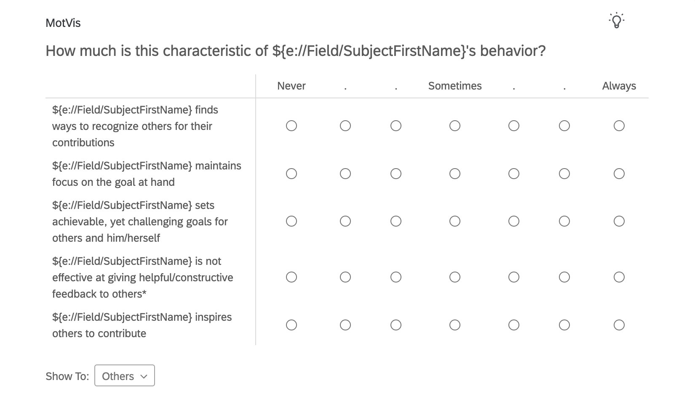
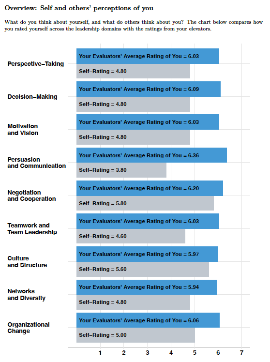
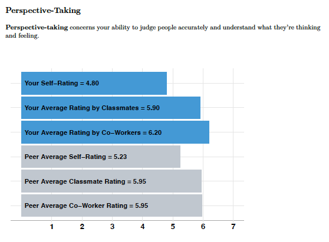
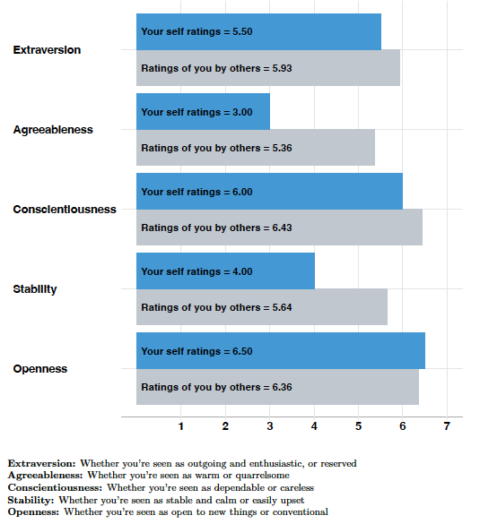

**I built and owned the data pipeline and automated report-generation workflow for Columbia Business School’s 360° Leadership Feedback program, enabling personalized, multi-source PDF reports at scale for MBA and EMBA cohorts.**

**The workflow replaced a costly third-party reporting setup, improved interpretability for students and coaches, and was recognized with a school-wide teaching award.**

```{=html}

<div style="display:flex; gap:24px; align-items:flex-start; margin-top:24px;">

  <!-- LEFT: Text (70%) -->
  <div style="flex:0.7; min-width:260px;">
    
    <h1 style="margin-top:0;">Context & Problem</h1>

    <p>
      As part of Columbia Business School’s <strong>core leadership curriculum</strong>, MBA and EMBA students complete a 360° feedback assessment that combines self-ratings, peer evaluations from classmates, and feedback from current or former coworkers. The resulting report serves as a <strong>key input to executive coaching sessions</strong>, where students reflect on their leadership style and define development goals.
    </p>

    <p>
      Prior to Fall 2022, the reporting workflow relied on a third-party Qualtrics XM solution that generated basic summary statistics and offered limited flexibility in how feedback could be structured or interpreted. While data collection was robust, the reports themselves were often difficult to use in practice. Comparisons were coarse, insights were hard to interpret, and faculty and coaches had limited ability to tailor outputs to pedagogical goals.
    </p>
    
    <p>
      At the same time, the program operated under strict constraints: fixed academic timelines, large cohorts, and the need to deliver sensitive, multi-source feedback in a way that was clear, psychologically safe, and usable by a non-technical audience. The challenge was not collecting more data, but transforming existing data into interpretable, decision-ready feedback that could reliably support leadership coaching at scale.
    </p>

  </div>

  <!-- RIGHT: Figure (30%) -->
  <div style="flex:0.3; min-width:320px;">
    
  </div>

</div>

```

# My Role & Ownership

I owned the data pipeline and automated report-generation workflow for the 360° Leadership Feedback system, from initial design through production. I built the reporting codebase from scratch, designed the data processing and automation infrastructure, and made core decisions about how multi-source feedback was processed, summarized, and presented to students.

Beyond implementation, I partnered closely with Management Division faculty and the Bernstein Center for Leadership to translate pedagogical goals into interpretable, actionable feedback. This included decisions about which comparisons to surface, how to balance clarity with analytical depth, and how to present sensitive peer feedback in a constructive way.

Over time, I evolved the system into a largely hands-off, fully automated workflow that reliably generated and distributed personalized PDF reports to thousands of students on a fixed academic timeline. I documented the system and structured the code to enable a smooth handoff to a dedicated data science team when I transitioned off the project.

# Impact Snapshot

- **Program-wide use:** Delivered to all MBA and EMBA students as part of the required leadership curriculum  
- **Scale:** Thousands of reports per term incorporating tens of thousands of evaluations  
- **Recognition:** Awarded a school-wide teaching award for leadership education impact

# The Product: Personalized 360 Reports

*How the reporting system translated multi-source data into usable leadership insight.*

The reporting system was designed to translate complex, multi-source feedback into insight that students and coaches could actually use. The structure intentionally surfaces high-level patterns first, with the option to drill down into more detailed views when needed, balancing clarity, psychological safety, and analytical depth.

## The Lead 360 Survey

*Designed to collect aligned, multi-source feedback that supports meaningful self–other comparison while preserving rater anonymity and trust.*

```{=html}
<div style="display:flex; gap:2rem; align-items:flex-start; margin:1.5rem 0;">

  <!-- Left column: bullets / text -->
  <div style="flex:1; min-width:0;">

    <ul>
      <li><strong>Self-assessment:</strong> During the week-long leadership course, students complete a self-assessment, rating their own leadership behaviors across a shared set of attributes.</li>

      <li><strong>Coworker feedback:</strong> Students nominate current or former coworkers, who complete an individualized version of the <em>same survey</em>, rating the student on the exact items used in the self-assessment.</li>

      <li><strong>Classmate feedback:</strong> Classmates, primarily within learning teams, provide peer evaluations informed by intensive teamwork, projects, and leadership exercises.</li>

      <li><strong>Privacy safeguards:</strong> Reports are generated only when a minimum of <strong>three raters per category</strong> are collected, preserving anonymity and encouraging candid feedback.</li>
    </ul>

  </div>

  <!-- Right column: image + caption -->
  <div style="flex:0 0 50%; text-align:center;">

    

    <div style="font-size:0.85rem; color:#666; margin-top:0.5rem;">
      Example of peer-report survey on students' Motivation and Vision.
    </div>

  </div>

</div>
```

## High-Level Feedback Overviews

*Surfaces clear, interpretable patterns to help students quickly calibrate how they see themselves versus how others experience them.*

```{=html}
<div style="display:flex; gap:2rem; align-items:flex-start; margin:1.5rem 0;">

  <!-- Left column: bullets / text -->
  <div style="flex:1; min-width:0;">

    <ul>
      <li><strong>Self vs. others’ perceptions:</strong> One overview compares how students rated themselves with how they were rated by their evaluators. This view helps students assess how accurately they understand the impact of their behavior on others—an especially important insight for leaders working to calibrate their presence.</li>

      <li><strong>Calibration and reassurance:</strong> For many students, this comparison reveals that they are viewed more positively by others than they view themselves. Identifying the specific domains where this is most pronounced helps them self-reflect as they move forward.</li>

      <li><strong>Peer benchmarking for development:</strong> Another overview compares a student’s average evaluator ratings with the class average across leadership domains, highlighting relative strengths and areas for growth.</li>

      <li><strong>Actionable next steps:</strong> Students frequently use this benchmarking to guide development decisions, such as selecting electives or seeking leadership experiences that address lower-scoring domains (e.g., negotiation and cooperation).</li>
    </ul>

  </div>

  <!-- Right column: image + caption -->
  <div style="flex:0 0 40%; text-align:center;">

    

    <div style="font-size:0.85rem; color:#666; margin-top:0.5rem;">
      Example of a student's overview of their self vs. others' perceptions.
    </div>

  </div>

</div>
```

## Domain-Level Deep Dives

*Enables focused exploration of specific leadership domains once high-level strengths and gaps are identified.*

```{=html}
<div style="display:flex; gap:2rem; align-items:flex-start; margin:1.5rem 0;">

  <!-- Left column: bullets / text -->
  <div style="flex:1; min-width:0;">

    <ul>
      <li><strong>Domain-specific views:</strong> Students can explore each leadership domain independently, with ratings broken out by source (self, classmates, coworkers) and compared against peer benchmarks.</li>

      <li><strong>Source-level transparency:</strong> This breakdown allows students to see where perceptions converge or diverge across different audiences, supporting more precise interpretation than a single aggregate score.</li>

      <li><strong>Item-level detail on demand:</strong> Within each domain, students can drill down to individual survey items, viewing item-by-item ratings by rater group.</li>

      <li><strong>Targeted development planning:</strong> After identifying priority domains, students use item-level feedback to pinpoint specific behaviors to work on (e.g., addressing a particular aspect of perspective-taking rather than the domain broadly).</li>
    </ul>

  </div>

  <!-- Right column: image + caption -->
  <div style="flex:0 0 40%; text-align:center;">

    

    <div style="font-size:0.85rem; color:#666; margin-top:0.5rem;">
      Example of a domain-level deep-dive into Perspective Taking.
    </div>

  </div>

</div>
```

## General Impressions & Personality (Big Five)

*Provides broader context for leadership feedback by highlighting how personality traits are perceived across different audiences.*

```{=html}
<div style="display:flex; gap:2rem; align-items:flex-start; margin:1.5rem 0;">

  <!-- Left column: bullets / text -->
  <div style="flex:1; min-width:0;">

    <ul>
      <li><strong>Broad impression benchmark:</strong> In addition to leadership-specific behaviors, the report includes feedback on the Big Five personality dimensions. These impressions provide a broader reference point for how students see themselves—and how they are seen by others—on traits that are not inherently “good” or “bad” for leadership.</li>

      <li><strong>Awareness over optimization:</strong> The goal of this section is not to score highly on any single dimension, but to increase awareness of how one’s personality is perceived across different audiences. Differences between self-ratings and others’ impressions often surface useful blind spots or strengths that shape leadership style indirectly.</li>

      <li><strong>Convergence and divergence:</strong> Students can see where their self-perceptions align with others’ impressions, and where they diverge, helping them interpret leadership feedback in a broader psychological context.</li>

    </ul>

  </div>

  <!-- Right column: image + caption -->
  <div style="flex:0 0 40%; text-align:center;">

    

    <div style="font-size:0.85rem; color:#666; margin-top:0.5rem;">
      Example personality impression view comparing self-ratings with others’ impressions.
    </div>

  </div>

</div>
```

# System Architecture & Automation

I designed a scalable analytics and reporting pipeline that transformed raw, multi-source survey data into reliable, personalized feedback products delivered on a fixed academic timeline. The system was built to minimize manual intervention, enforce privacy constraints, and produce consistent outputs at scale.

The reporting system was built as a two-stage analytics pipeline: a centralized data processing script followed by a parameterized report-generation layer.

  - **Centralized data processing:** Raw numeric and open-text survey data were ingested from Qualtrics and transformed into a single, analysis-ready dataset. This step handled data validation, scale construction, reverse scoring, rater-count thresholds, and harmonization across self, peer, and coworker inputs to ensure consistency and reproducibility.
  - **Student-level aggregation:** Within the processing script, the pipeline computed domain-level and item-level summary statistics for each student, separately by rater source. This produced a structured set of student-specific inputs—including self-ratings, source-specific averages, peer aggregates, and benchmarking statistics—used downstream for report generation.
  - **Conditional report logic:** To preserve anonymity while maximizing usable feedback, students were automatically routed into different reporting paths based on available rater data. This ensured privacy thresholds were enforced without blocking report delivery.
  - **Parameterized report generation:** A parameterized R Markdown template was then used to generate personalized PDF reports. The system looped over student identifiers, injecting each student’s precomputed summaries and qualitative feedback into a standardized report structure and rendering the output via LaTeX.
  - **Batch execution and reliability:** Once configured for a term, the pipeline could be executed end to end to generate all reports in a single batch run, producing deterministic outputs with minimal manual oversight and predictable turnaround times.

# Responsible AI for Qualitative Feedback

Each reporting cycle included tens of thousands of open-ended peer comments. These comments needed to be reviewed for offensive, inappropriate, or harmful language before being shared with students, both to protect recipients and to meet institutional standards for psychological safety.

  - **Problem context:** Manual review of qualitative feedback had become a major operational bottleneck. Research assistants reviewed every comment by hand, which was slow, costly, delayed report delivery, and still required faculty oversight for edge cases.
  - **AI-assisted screening:** I introduced an AI-assisted moderation step using the OpenAI API and looping through all comments to flag those that were potentially problematic. The model was used strictly as a triage tool, not as a final decision-maker.
  - **Deliberate error tradeoff:** The system was intentionally tuned to favor false positives over false negatives. This ensured that potentially harmful content was unlikely to reach students, while accepting that some benign comments would require brief human review.
  - **Human-in-the-loop review:** All flagged comments were reviewed by faculty and administrators, who decided whether content should be edited, removed, or left unchanged before reports were generated.
  - **Impact on speed and cost:** This approach reduced the review set from ~20,000 comments to roughly ~100 per term, dramatically lowering review time and cost while preserving safety and oversight.
  
By constraining AI to a clearly defined, high-friction task and embedding it within a human review workflow, the system balanced efficiency gains with accountability and trust.

# Impact & Reach

  - **Program-wide deployment:** The system was adopted as a core component of Columbia Business School’s required leadership curriculum, used by all MBA and EMBA students as part of their leadership development journey. The reports became the primary input for one-on-one executive coaching sessions and were directly referenced by faculty and coaches in development planning conversations.
  - **Scale:** Each academic term, the pipeline reliably generated and delivered thousands of personalized 360° feedback reports, incorporating tens of thousands of peer evaluations across multiple rater sources. Once configured for a term, the system ran end to end with minimal manual intervention, meeting strict academic deadlines and scaling without additional staffing.
  - **Behavior & decision impact:** The redesigned reports materially changed how feedback was used in practice
    - Higher student engagement with feedback materials
    - More focused and actionable coaching conversations, grounded in clear patterns rather than raw scores
    - Students used the reports to set concrete leadership development goals, select electives, and seek targeted leadership experiences
  - **Operational efficiency:** By replacing an expensive third-party reporting solution and eliminating large amounts of manual coordination and review, the system
    - Reduced recurring vendor and labor costs
    - Shortened report delivery timelines
    - Lowered administrative burden on faculty and staff
  - **Organizational trust & longevity:** The system handled sensitive, multi-source feedback for thousands of students, reflecting a high level of trust from faculty, administrators, coaches, and students. Importantly, the infrastructure continued to operate after I transitioned off the project, demonstrating that the work was not just successful, but institutionalized.

# Continuity & Handoff

  - **Sustainable ownership:** The system was designed to run with minimal ongoing intervention, with clear separation between data preparation, report logic, and output generation.
  - **Documented and transferable:** All scripts, dependencies, and term-specific steps were documented, enabling a smooth handoff to a dedicated data science team without disruption to report delivery.
  - **Institutionalized workflow:** After I transitioned off the project, the pipeline continued to operate as a recurring, productionized component of the leadership curriculum.

# Reflections & Tradeoffs

  - **Clarity over complexity:** Throughout the report design, I prioritized interpretability and psychological safety over more complex modeling or dense visualizations, given the stakes and audience.
  - **Automation with boundaries:** While much of the pipeline was automated, I intentionally preserved human review at key points (e.g., qualitative feedback moderation) to balance efficiency with accountability.
  - **Depth on demand:** Rather than forcing all users into detailed analysis, the report was structured to surface high-level patterns first, with optional drill-down for students and coaches who wanted more specificity.

# Recognition & Stakeholder Trust

  - **Institutional recognition:** This work was recognized with a school-wide teaching award for its contribution to leadership education and student development.
  - **Faculty adoption:** Management Division faculty incorporated the system into a required leadership course, relying on it as a core input to executive coaching and development planning.
  - **High-trust deployment:** The system handled sensitive, multi-source feedback for thousands of students, reflecting a high level of trust from faculty, administrators, and coaches in both the analytics and the delivery process.